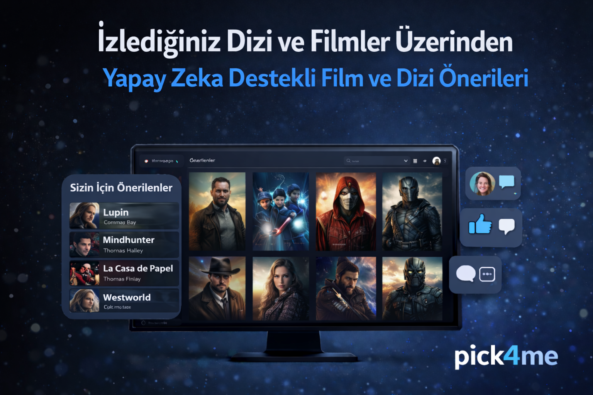

# pick4me

## Proje Hakkında

**Proje Tanımı:** 
> Projenin ne iş yaptığını anlatan bir paragraflık tanıtım metni buraya yazılacaktır.

**Örnek:** pick4me, kullanıcıların izledikleri film ve dizilere göre yapay zeka destekli kişisel öneriler sunan bir web platformudur.
Kullanıcılar izledikleri içerikleri takip edebilir, puanlayabilir ve bu etkileşimlere dayalı olarak kendilerine en uygun film ve dizi önerilerini alabilir.

Platform, klasik listeleme mantığının ötesine geçerek kullanıcı davranışlarını analiz eder ve kişiselleştirilmiş öneriler üretir. Amaç, kullanıcıların zevklerine en yakın içerikleri hızlı ve etkili bir şekilde keşfetmelerini sağlamaktır.

Bu proje, modern web teknolojileri ve temel yapay zeka yaklaşımlarını bir araya getirerek ölçeklenebilir, kullanıcı odaklı ve geliştirilebilir bir film–dizi öneri sistemi oluşturmayı hedefler.

**Proje Kategorisi:** 
> Kategori: Medya & Eğlence | Yapay Zeka Tabanlı Film–Dizi Öneri Sistemi

**Referans Uygulama:** 
> [Örnek Referans Uygulama](https://example.com)

---

## Proje Linkleri

- **REST API Adresi:** [api.yazmuh.com](https://api.yazmuh.com)
- **Web Frontend Adresi:** [frontend.yazmuh.com](https://frontend.yazmuh.com)

---

## Proje Ekibi

**Grup Adı:** 
> TuBug

**Ekip Üyeleri:** 
- Alper Çapan
- Ferhat Demir

---

## Dokümantasyon

Proje dokümantasyonuna aşağıdaki linklerden erişebilirsiniz:

---
